<div class="max-w-3xl">

# 주니어 개발자인 내가 이세계에선 V8 코드를 읽는 사람?!?
~ 디버깅 마법으로 즐거운 이세계 생활 ~

</div>
---

# 발표자 소개
[@Khinenw](https://github.com/HelloWorld017)
* <fluent-emoji-man-facepalming /> 현재 ~~휴학생~~ 백수
* <fluent-emoji-baby-chick /> 당시에는 리디에서 일하던 2년차 뉴비 프론트 엔지니어
* <fluent-emoji-hammer-and-wrench /> **V8과 나는 접점이 없을 것이라 생각하고 있었음**

---

# 발단

바야흐로 2022년...

### 코드
```ts
/**
 * @description { id, isFiltered }[] 형식을 { [id]: isFiltered }로 변환합니다.
 */
const entriesToObject = (entries: { id: number, isFiltered: boolean }[]): Record<number, boolean> =>
  entries.reduce((filter, { id, isFiltered }) => ({ ...filter, [id]: isFiltered }), {});

const entries = generate();
time('without shuffle', () => entriesToObject(entries));
time('with shuffle', () => entriesToObject(shuffle(entries)));
```

### 결과
```
without shuffle elapsed:  9.33551
with shuffle elapsed:  1678.268196
```

---
layout: center
---

<div class="flex flex-col items-center">
    <h1 class="text-center">...?</h1>
    <fluent-emoji-thinking-face class="text-7xl" />
    <p>오브젝트에 할당하는 순서의 차이만으로 이 만큼 속도 차이가?</p>
</div>

---

## 사실 별로 이걸 까볼 생각은 없었는데...
* <lucide-dot /> 블로그 글을 쓰자는 제안이 와서 얼떨결에 수락해버림
* <lucide-dot /> 글을 쓰는데 뭔가 틀린 정보를 쓰면 회사의 이미지가 깎일 것 같음
* <lucide-arrow-right /> 잘 알아보고 써야하게 생겼음 (심지어 시간이 무한하지도 않은 상황)

---

## 디버깅 시작
내가 알고 있었던 것:
* <lucide-dot /> V8에는 "뭔가 괜찮은 형태"의 객체들만 따로 최적화하는게 있다더라
* <lucide-dot /> Hoxy 얘도...?
* <lucide-arrow-right /> **알고는 있었지만 확신은 없었음**
* <lucide-arrow-right /> **정말인지 확인해보자!**

### 목적
* 다음 가설을 증명하기

<div class="b-l-1 b-white p-l-5">

> <fluent-emoji-light-bulb /> **"전자의 객체는 연속된 숫자가 키인 객체라서 별도로 처리돼 빨랐을 것이다!"**

</div>

---

## 0. 야매적 접근
* 내가 알고 있었던 개념의 정확한 이름이 FastProperties 였음 [v8.dev/blog/fast-properties](https://v8.dev/blog/fast-properties)
* 처음에는 V8 코드를 읽을 생각조차 하지 않음
* `node --allow-natives-syntax` 로 `%DebugPrint` 로 각 값을 찍어봄

```js
%DebugPrint(entriesToObject(entries));
%DebugPrint(entriesToObject(shuffle(entries)));
```

### 결과
<div class="flex gap-2">

```
DebugPrint: 0x145edbc0e1a9: [JS_OBJECT_TYPE]
 - map: 0x34718ba0cd81 <Map[56](HOLEY_ELEMENTS)> [FastProperties]
 - prototype: 0x34718ba2d7e1 <Object map = 0x34718ba01bd1>
 - elements: 0x145edbc01141 <FixedArray[6667]> [HOLEY_ELEMENTS]
 - properties: 0x382e74100c31 <FixedArray[0]>
 - All own properties (excluding elements): {}
 - elements: 0x145edbc01141 <FixedArray[6667]> {
           0: 0x382e74100109 <true>
           1: 0x382e741000d9 <false>
         2-3: 0x382e74100109 <true>
           4: 0x382e741000d9 <false>
```

```
DebugPrint: 0xef7548ce1a9: [JS_OBJECT_TYPE]
 - map: 0x34718ba0cd81 <Map[56](HOLEY_ELEMENTS)> [FastProperties]
 - prototype: 0x34718ba2d7e1 <Object map = 0x34718ba01bd1>
 - elements: 0x33b382f134f1 <FixedArray[6667]> [HOLEY_ELEMENTS]
 - properties: 0x382e74100c31 <FixedArray[0]>
 - All own properties (excluding elements): {}
 - elements: 0x33b382f134f1 <FixedArray[6667]> {
           0: 0x382e74100109 <true>
           1: 0x382e741000d9 <false>
         2-3: 0x382e74100109 <true>
           4: 0x382e741000d9 <false>
```

</div>

---
layout: center
---

<div class="flex flex-col items-center">
<fluent-emoji-downcast-face-with-sweat class="text-7xl" />

### 역시 개발자는 코드를 읽어야지...
</div>

---

## 1. CodeSearch

* 크로뮴 관련 프로젝트에는 코드서치라는 도구가 있음 [source.chromium.org](https://source.chromium.org/)
    * <lucide-dot class="ml-5" /> 구현이 궁금한 개발자의 효율 200% 증가템
    * <lucide-dot class="ml-5" /> 자매품으로 안드로이드 코드서치도 있음 [cs.android.com](https://cs.android.com/)

---

## 1. CodeSearch

검색해보자..!
<div class=" max-w-150 mt-5">

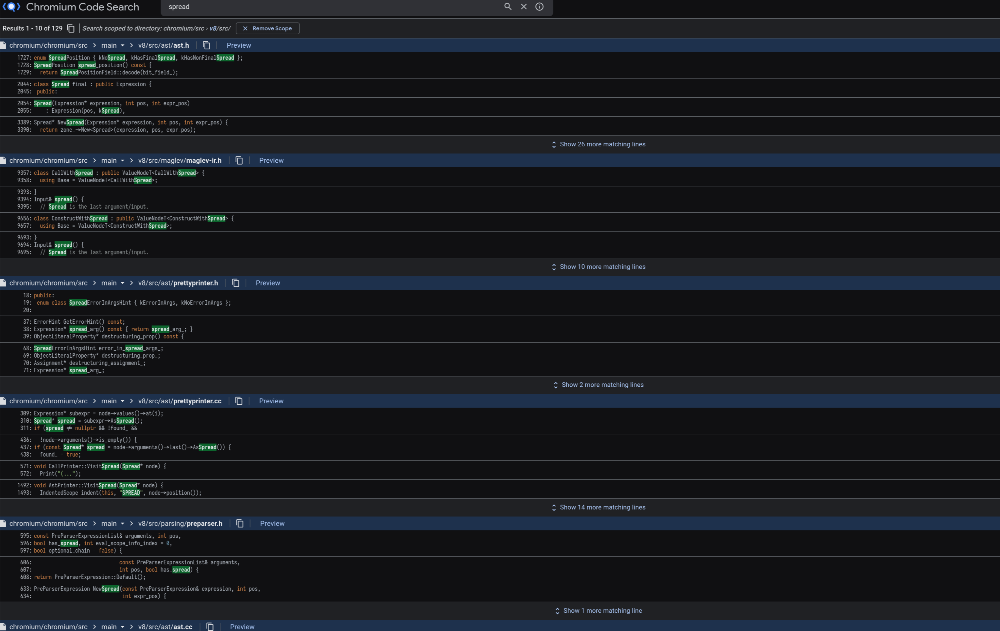
<span class="text-xs line-through">이 때는 대략 정신이 멍해진다</span>

</div>

---

## 1. CodeSearch

이런 코드를 찾음
<div class="max-w-150 mt-5">

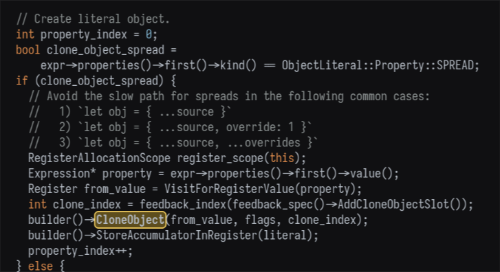

</div>

---
layout: center
---

느낌상 AST 상에서 ObjectLiteral 안에 있는 Spread는  
`CloneObject` 라는 바이트코드를 사용해서 번역되는 것 같음

그리고 얘를 파면 뭔가 정답에 가까워질 것 같음

---

## 2. Bytecode 뒤지기

진짜일까?

<div class="max-w-150 mt-5">

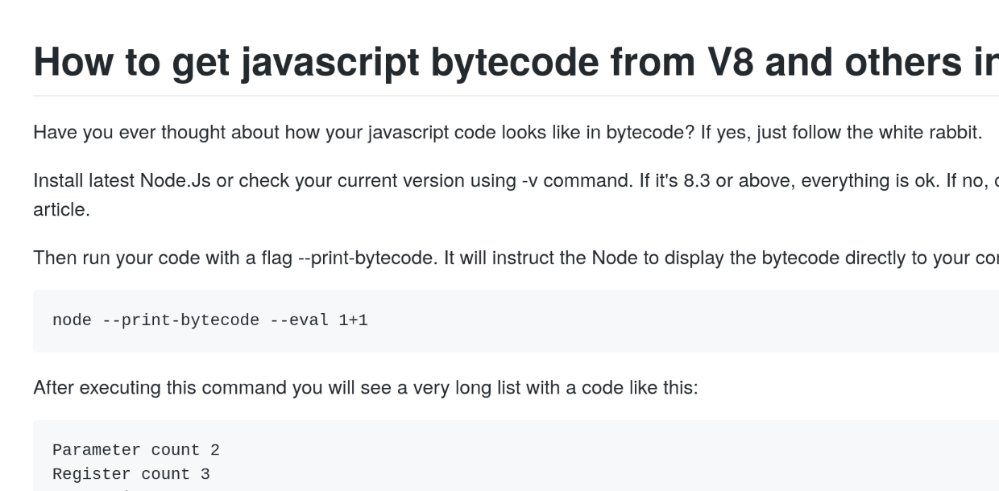

</div>

검증해보자!

---

## 2. Bytecode 뒤지기

```
$ node --print-bytecode --print-bytecode-filter=testtest test.js > bytecode.txt 
```

<div class="max-w-150 mt-5">

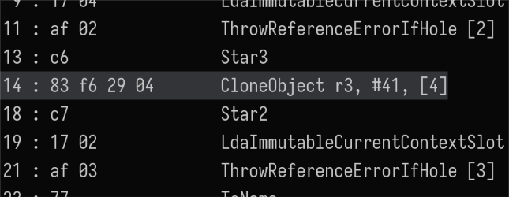

</div>

진짜였다!

---

## 3. 간단한 V8의 동작방식

제대로 들어가기에 앞서 대략적인 V8의 구조에 대해 먼저 알아보자
<div class="max-w-150 mt-5">

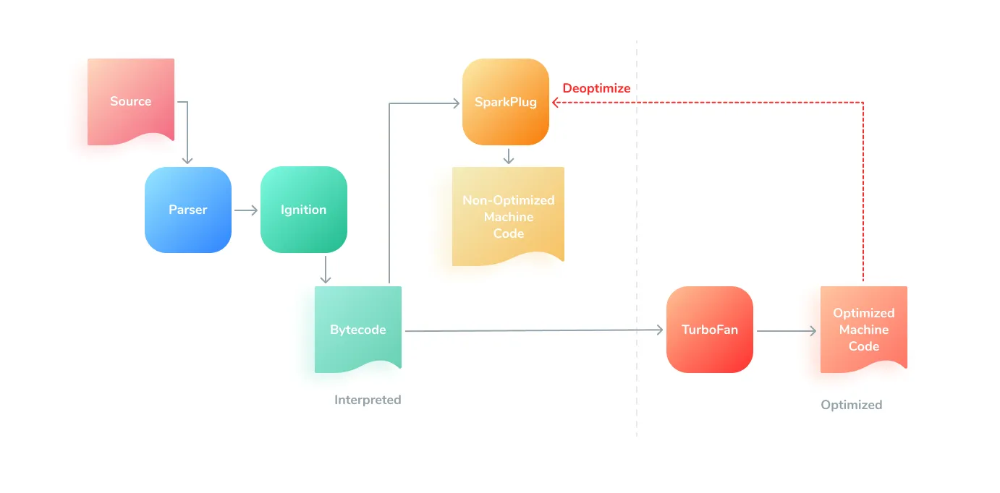

</div>
<span class="text-xs">

출처: [medium.com/@yanguly](https://medium.com/@yanguly/sparkplug-v8-baseline-javascript-compiler-758a7bc96e84)

</span>

~~누가 이름 V8 아니랄까봐 엔진 관련 이름으로 컨셉 잡는다.~~

---

## 3. 간단한 V8의 동작방식

* <lucide-dot /> 코드를 생성하는 방식은 CodeStubAssembler와 Torque가 있음
* <lucide-dot /> 전자는 기존에 쓰던 C++ 매크로 가지고 생성하는 방식
* <lucide-dot /> 후자는 유사-타입스크립트 Syntax로 새로 자체 구현한 언어
* <lucide-dot /> **이번 발표에서는 토크를 볼일이 없다**

---

## 4. 그러면 `CloneObject` 는 어떻게 실행될까?

<div class="max-w-75 mt-5">

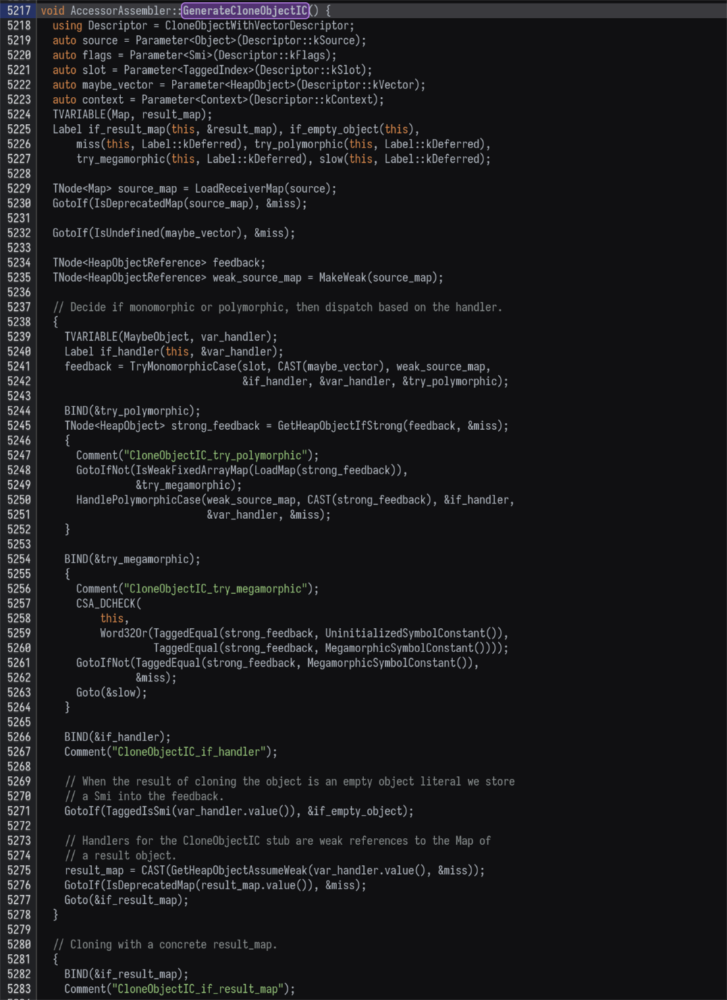

</div>

* 또 코드서치를 때려보니 `AccessorAssembler::GenerateCloneObjectIC` 라는 데가 있음
* 뭔가 코드스텁 어셈블리 스러운 코드가 잔뜩 있는게 여기서 생성하는 것 같음


---

## 4. 그러면 `CloneObject` 는 어떻게 실행될까?
* 자세히 보면 여러개의 케이스로 나눠서 가장 최적화된 쪽을 태우는 걸 볼 수 있음
    * <lucide-arrow-right class="ml-5" /> 인라인 캐시가 Monomorphic / Polymorphic / Megamorphic인 케이스를 나눔  
      * <lucide-info class="ml-15" /> 하나의 형태의 객체만 받으면 Mono, 2-4개의 형태를 받으면 Poly, 5개 이상은 Mega
    * <lucide-arrow-right class="ml-5" /> **그 결과에 따라서 `FastCloneJSObject` 를 탈 수도, `CloneObjectIC_Slow` Builtin을 탈 수도, `CloneObjectIC_Miss` Runtime을 탈 수도 있음**

* 조건들을 하나씩 따져볼까?
    * <lucide-dot class="ml-5" /> 이거 조건 하나하나 따지고 있기 귀찮은데?
    * <lucide-dot class="ml-5" /> 그리고 그렇게 열심히 추론했는데 실제로 돌린 결과가 다르면?

---
layout: center
---

<div class="flex flex-col items-center">


### 이게 아니야... 더 강력한게 필요해...
(코드를 돌려보고 그 결과를 관측하기로 결심)

</div>

---

## 5. 뭔가 `--trace-all` 을 써보라고 한다.

구글에 V8 디버깅에 대해서 검색해본 결과 V8 에 몇가지 플래그가 있어서 그걸 사용하면 된다고 한다.
* <lucide-dot /> 그 중에 하나가 `--trace-all`
* <lucide-dot /> 실행시키면 다음 결과가 나를 맞이해준다.
<div class="ml-5">

```
node: bad option: --trace-all
```

</div>

* <lucide-dot /> 알고보니 `--log-all` 로 대체된지 오래
    * <lucide-info class="ml-10" /> `--log-ic` 등등 궁금한 것만 하나씩 찍어볼 수도 있다.
* <lucide-dot /> 다음 파일이 생겼다!
<div class="ml-5">

```
.rw-r--r--   53M nenw 31  1월 15:45 isolate-0x335ff000-2055688-v8.log
```

</div>

---

## 6. Indicium은 나를 살려주러 온 것인가?

* 저걸 직접 읽고 있자니 정신이 아득해져온다.
* 찾아보니 Indicium 이라는게 있어서 저 로그를 분석할 수 있다고 한다. [v8.dev/blog/system-analyzer](https://v8.dev/blog/system-analyzer)
* 이 위치에서 지금 확인해볼 수 있다. [v8.gihtub.io/tools/head/system-analyzer](https://v8.github.io/tools/head/system-analyzer/)

<div class="max-w-180">
    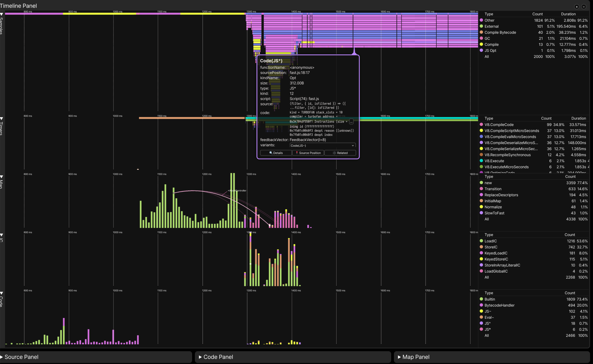
</div>

---

## 6. Indicium은 나를 살려주러 온 것인가?
* 생성된 어셈블리를 확인할 수 있었다.
* 그런데 IC List를 뒤져보고 Transitions를 뒤져봐도 내가 원하는 정보는 찾기 어려웠다.

<div class="max-w-180">
    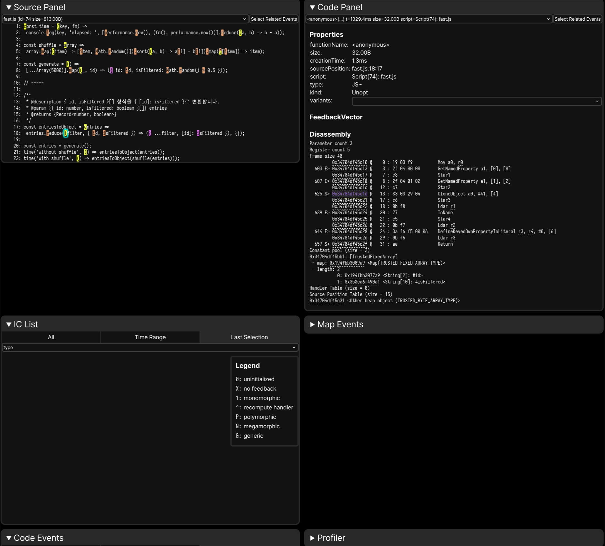
</div>

---

## 7. 다들 어케 디버깅하지?
* <lucide-dot /> 코드 안에 `Comments()` 를 통해 어떤 일을 하는지가 대충 나타나 있었다.
* <lucide-dot /> `--code-comments` 를 통해서 볼 수 있나?
* <lucide-arrow-right /> **그건 말 그대로 주석 느낌이고 실행될 때 출력되는 것이 아님**
* <lucide-arrow-right /> 그런 용도로는 `Print()` 가...

---
layout: center
---

<div class="flex flex-col items-center">


끝없는 Try & Error 의 시간

</div>

---

## 8. 아니 그래서 어케 디버깅해요?

찾다찾다 나를 반겨준 스오플의 한 글
[stackoverflow.com/questions/56857660](https://stackoverflow.com/questions/56857660/debugging-codestubassembler-csa-code-in-v8)

<div class="flex flex-row items-start gap-4 pr-10">
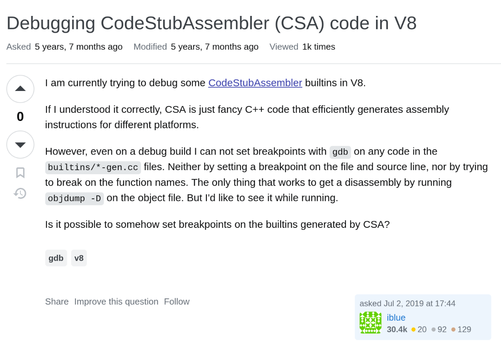
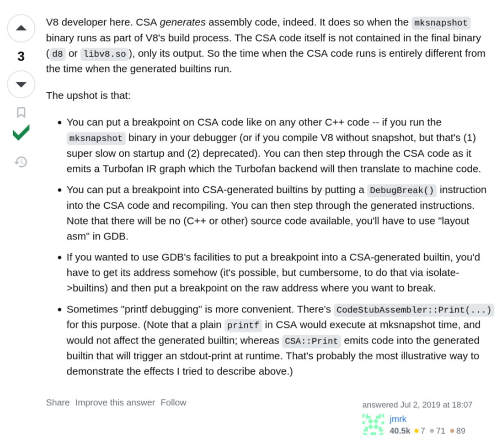
</div>

---

## 8. 아니 그래서 어케 디버깅해요?

### 결론
* <lucide-dot /> V8 개발자 피셜 디버거로 CSA로 만들어진 코드를 찍어봐야 한다.
* <lucide-dot /> 그 주소를 어떻게 알아내서 찍던가, 아니면 코드 수정해서 인스트럭션 삽입하던가
* <lucide-arrow-right /> **아니 나는 이걸 하고 있을 시간이 없는데??**

---

## 9. 해결
다시 한 번 코드를 보자.

<div class="flex flex-row items-start gap-4 pr-10">
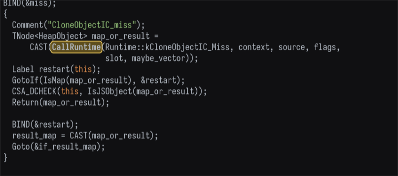
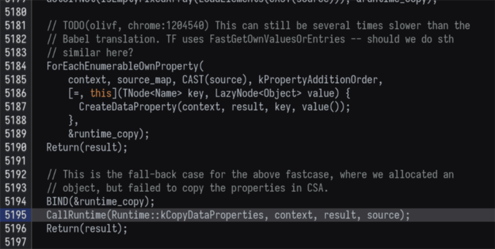
</div>

* Runtime은 생성된 코드가 아니다 <lucide-arrow-right /> 쉽게 디버거를 찍어볼 수 있겠다!

---

## 9. 해결

### BreakPoint 셋팅
* <lucide-dot /> 참고로 여기 쓰인 `d8` 은 `v8`의 자체 개발용 쉘 (Kinda node.js) 이다
* <lucide-arrow-right class="ml-10" /> 디버그 심볼 다 살아있고, 온갖 테스트해볼 수 있는 로우레벨 옵션이 다 있음

<br />

```python {4-5|9-10}
(lldb) target create "d8"
Current executable set to '/nix/store/r9d1kpz5zx163znwrs42zkbbpcbqlm1f-v8-8.4.255/bin/d8' (x86_64).

# Miss Case 시 실행되는 런타임에 BreakPoint
(lldb) br se -M __RT_impl_Runtime_CloneObjectIC_Miss -G1
Breakpoint 1: where = d8`v8::internal::__RT_impl_Runtime_CloneObjectIC_Miss(v8::internal::Arguments<(v8::internal::ArgumentsType)0>,
v8::internal::Isolate*), address = 0x00000000009980b0

# Slow Case 시 실행되는 런타임에 BreakPoint
(lldb) br se -M __RT_impl_Runtime_CopyDataProperties -G1
Breakpoint 2: where = d8`v8::internal::__RT_impl_Runtime_CopyDataProperties(v8::internal::Arguments<(v8::internal::ArgumentsType)0>,
v8::internal::Isolate*), address = 0x0000000000d8fbf0
```

---

## 9. 해결

### <fluent-emoji-snail /> 느렸던 예제

```python {1-2|6-7,11,15}
# 느렸던 예제 실행
(lldb) run slow.js
Process 2163459 launched: '/nix/store/r9d1kpz5zx163znwrs42zkbbpcbqlm1f-v8-8.4.255/bin/d8' (x86_64)
Process 2163459 exited with status = 0 (0x00000000)

# BreakPoint 확인
(lldb) br list
Current breakpoints:
1: name = '__RT_impl_Runtime_CloneObjectIC_Miss', locations = 1, resolved = 1, hit count = 1 Options: enabled auto-continue
  1.1: where = d8`v8::internal::__RT_impl_Runtime_CloneObjectIC_Miss(v8::internal::Arguments<(v8::internal::ArgumentsType)0>,
    v8::internal::Isolate*), address = 0x0000555555eec0b0, resolved, hit count = 1

2: name = '__RT_impl_Runtime_CopyDataProperties', locations = 1, resolved = 1, hit count = 4998 Options: enabled auto-continue
  2.1: where = d8`v8::internal::__RT_impl_Runtime_CopyDataProperties(v8::internal::Arguments<(v8::internal::ArgumentsType)0>,
    v8::internal::Isolate*), address = 0x00005555562e3bf0, resolved, hit count = 4998
```

-> `Slow`

---

## 9. 해결

### <fluent-emoji-racing-car /> 빨랐던 예제

```python {1-2|6-7,11,15}
# 빨랐던 예제 실행
(lldb) run fast.js
Process 2163506 launched: '/nix/store/r9d1kpz5zx163znwrs42zkbbpcbqlm1f-v8-8.4.255/bin/d8' (x86_64)
Process 2163506 exited with status = 0 (0x00000000)

# BreakPoint 확인
(lldb) br list
Current breakpoints:
1: name = '__RT_impl_Runtime_CloneObjectIC_Miss', locations = 1, resolved = 1, hit count = 1 Options: enabled auto-continue
  1.1: where = d8`v8::internal::__RT_impl_Runtime_CloneObjectIC_Miss(v8::internal::Arguments<(v8::internal::ArgumentsType)0>,
    v8::internal::Isolate*), address = 0x0000555555eec0b0, resolved, hit count = 1

2: name = '__RT_impl_Runtime_CopyDataProperties', locations = 1, resolved = 1, hit count = 29 Options: enabled auto-continue
  2.1: where = d8`v8::internal::__RT_impl_Runtime_CopyDataProperties(v8::internal::Arguments<(v8::internal::ArgumentsType)0>,
    v8::internal::Isolate*), address = 0x00005555562e3bf0, resolved, hit count = 29
```

-> `Fast`

---

## 결론

<div class="b-l-1 b-white p-l-5">

> <fluent-emoji-check-mark-button /> **"전자의 객체는 연속된 숫자가 키인 객체라서 별도로 처리돼 빨랐을 것이다!"**

</div>

## 느낀점
* <lucide-dot /> 자료가 없다... 정말 없다...
* <lucide-dot /> 그런데 공식 도큐먼트랑 블로그가 너무 잘돼있다
    * <lucide-arrow-right class="ml-10" /> V8 개발을 할 일이 없더라도 한번쯤 시간 떼우기로 읽기 좋아보임
* <lucide-dot /> 그 외에도 제대로 써보진 못했지만 Indicium 등 쓸만한 도구가 많다
* <lucide-dot /> 프론트 개발자로서 한번쯤 보고 싶었던 V8을 제대로 볼 수 있었다 <fluent-emoji-partying-face />

## 기타
* d8 써보려고 최신버전 v8 빌드하다가 1시간 넘게 걸려서 OOM 맞았습니다
    * <lucide-dot class="ml-5" /> 이 걸 처음 했을 당시에는 `nixpkgs-unstable` 에 있었음
    * <lucide-dot class="ml-5" /> 최근에는 유지보수 이슈로 빠짐 <fluent-emoji-crying-face />

---

## 당부사항
* 오류가 있을 수 있습니다!
    * <lucide-dot class="ml-5" /> 지적 환영합니다.
* 난 순차적인 객체니까 reduce() + Spread 써야지 하시는 분들께:
    * <lucide-arrow-left class="ml-5" /> 하지 말아주세요. $O(n^2)$ 임에는 변함이 없습니다.
