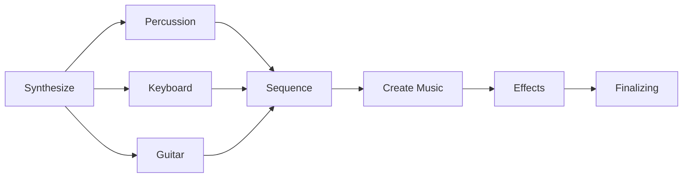

# Making Simple Music from Zero
Yohan Kim

---

## Table-of-Contents
<br />



---
layout: 'section'
color: 'blue-light'
---

## Synthesizing

---

## Synthesizing
### Percussion / Kick

**Kick**: Sine waves with a bit of sawtooth waves

```python {11-16}
def synthesize_drum_kick():
    dur = 0.1
    sample_len = int(dur * fs)

    pitch_env = np.logspace(np.log10(1), np.log10(0.1), sample_len)
    amp_env = np.append(
        (np.logspace(np.log10(0.01), np.log10(1.01), 100) - 0.01),
        (np.logspace(np.log10(1.1), np.log10(0.1), sample_len - 100) - 0.1)
    )

    x = stack_sounds([
        oscillate(pitch_env * 83, kind='sin') * 0.8,
        (oscillate(pitch_env * 71, kind='saw') * 0.05, 0.01),
        (oscillate(pitch_env * 74, kind='saw') * 0.05, 0.02),
        (oscillate(pitch_env * 91, kind='saw') * 0.05, 0.03)
    ])
    return clamp(x * amp_env * 3)
```

<audio class="origin-left scale-60" src="./assets/drum-bass.wav" controls />

---

## Synthesizing
### Percussion / Tom Toms

* As a drum guy, I wanted to achieve more realistic snare sounds
* Used Karplus-Strong synthesize

---

## Synthesizing
### Percussion / Tom Toms

**1. Create Transient**

```python {6-13}
def synthesize_drum_tom(opts):
    # Base Transient
    dur = opts['transient_dur']
    sample_len = int(fs * dur)
    attack = int(fs * opts['attack_dur'])
    pitch_env = np.logspace(np.log10(1),np.log10(0.001), sample_len)
    amp_env = np.append(
        np.logspace(np.log10(0.001),np.log10(1), attack),
        np.logspace(np.log10(1),np.log10(0.001), sample_len - attack)
    )
    x = (np.random.rand(sample_len) - 0.5) / 2
    x += oscillate(pitch_env * 25, kind='square') / 2
    x *= amp_env
    x1 = x
```

---

## Synthesizing
### Percussion / Tom Toms

**2. Resonance Using Feedback**

```python {11-19}
    feedback_delay = np.ones(sample_len) * opts['feedback_delay']
    feedback_gain = opts['feedback_gain']
    x = np.zeros(sample_len)
    x[0:len(x1)] = x1

    bl = signal.firwin(151, cutoff=opts['highpass_cutoff'], fs=fs, pass_zero='highpass')
    zl = signal.lfilter_zi(bl, 1) * x[0]
    bh = signal.firwin(151, cutoff=opts['lowpass_cutoff'], fs=fs, pass_zero='lowpass')
    zh = signal.lfilter_zi(bh, 1) * x[0]

    for i in range(len(x)):
        feedback_index = int(i - feedback_delay[i])
        if feedback_index >= 0:
             x[i] += x[feedback_index] * feedback_gain

        x_window = [x[i]]
        x_window, zh = signal.lfilter(bh, 1, x_window, zi=zh)
        x_window, zl = signal.lfilter(bl, 1, x_window, zi=zl)
        x[i] = max(-0.9, min(x_window[-1], 0.9))
```

---

## Synthesizing
### Percussion / Tom Toms

**Snare**: Tom Tom Base + `Snappy`

```python {2,9-11}
def synthesize_drum_snare():
    x = synthesize_drum_tom(opts)
    x = np.convolve(x, np.ones(50) * 1 / 50)

    # Add noise
    dur = 0.4
    sample_len = int(dur * fs)

    amp_env = np.logspace(np.log10(1), np.log10(0.01), sample_len)
    x3 = (np.random.rand(sample_len) - 0.5) / 2
    x3 = signal.lfilter(*res_bandpass(1500, 0.7), x3) * amp_env

    return clamp(stack_sounds([ x, x3 * 0.5 ]) * 6)
```

<audio class="origin-left scale-60" src="./assets/drum-snare.wav" controls />

----

## Synthesizing
### Percussion / Tom Toms

**Floor Tom**: Tom Tom Base + `Dynamic Delay`

```python {2-7,8,15,16}
def synthesize_drum_floortom(delay_offset = 50):
    delay_shape = (825 + delay_offset) * envelope_points(0.4, [
        (1, 1, 0, 0.1, 1),
        (1.5, 2, 0, 0, 1.5),
        (1.6, 0, 0, 0.01, 3),
    ], start=1)

    x = synthesize_drum_tom({ 'feedback_delay': delay_shape, **opts })
    x = signal.lfilter(*res_bandpass(196, 2), x) * 0.3 + \
        signal.lfilter(*res_bandpass(90, 2), x) * 0.7

    amp_env = envelope(0.4, 0.01, 0.18, 0.001, 0.01)
    x3 = (np.random.rand(len(amp_env)) - 0.5) / 2
    x3 = signal.lfilter(*res_bandpass(6700, 1), x3) * amp_env
    x3 = np.convolve(x, np.ones(5) * 1 / 5)
    x = np.convolve(x, np.ones(20) * 1 / 20)
    x[0:len(x3)] += x3
```

<audio class="origin-left scale-60" src="./assets/drum-floor.wav" controls />

----

## Synthesizing
### Percussion / Hi-Hat

**Hi-Hat**: Noise with Filter

```python
def synthesize_drum_hi_hat_closed():
    dur = 0.1
    sample_len = int(dur * fs)

    b, a = res_highpass(4000, 2)
    amp_env = np.logspace(np.log10(1), np.log10(0.01), sample_len)
    
    x = (np.random.rand(sample_len) - 0.5) / 2
    x = signal.lfilter(b, a, x)
    x = amp_env * x
    
    return clamp(x * 0.3)
```

<audio class="origin-left scale-60" src="./assets/drum-hihat.wav" controls />

----

## Synthesizing
### Percussion / Crash

**Crash**: Randomized `Sawtoothes`, `Delay`, `Filters`

```python
def synthesize_drum_crash():
    dur = 1.3
    sample_len = int(dur * fs)
    attack_len = int(0.05 * fs)

    # Envelopes
    amp_env = np.append(
        np.logspace(np.log10(0.1), np.log10(1.1), attack_len) - 0.1,
        np.logspace(np.log10(1.1), np.log10(0.001), sample_len - attack_len) - 0.001
    ) * (0.85 + np.sin(np.linspace(0, 8 * np.pi, sample_len)) * 0.15)

    # Oscillator
    t = np.linspace(0, 1, sample_len)
    x = ((np.random.rand(sample_len) - 0.5) / 2) * 0.3
    x += stack_sounds([
        (np.clip(np.random.rand() * 0.005 + t, 0, 1) *
        (5000 + (i / 32 + np.random.rand() * 0.03) * 2000)) % 1 *
        (np.random.rand() * 0.3 + 0.7) * (1 / 48)
        for i in range(48)
    ])
```

----

## Synthesizing
### Percussion / Crash

**Crash**: Randomized `Sawtoothes`, `Delay`, `Filters`
```python
    # Feedback
    feedback_delay = 2000
    feedback_gain = 0.6
    for i in range(len(x)):
        feedback_index = i - feedback_delay
        if feedback_index <= 0:
            x[i] = max(-0.9, min(x[i], 0.9))
            continue
        x[i] += x[feedback_index] * feedback_gain

    # Filters
    x = signal.lfilter(*res_lowpass(15000, 0.4), x)
    x = signal.lfilter(*res_highpass(100, 0.1), x)
    x = signal.lfilter(*res_bandpass(7000, 0.1), x)
    x *= amp_env

    return clamp(x * 1.6)
```

<audio class="origin-left scale-60" src="./assets/drum-crash.wav" controls />

----

## Synthesizing
### Percussion

* **Kick**: Sine waves with a bit of sawtooth waves  
* **Snare**: Tom Tom Base + `Snappy`  
* **Floor Tom**: Tom Tom Base + `Dynamic Delay`  
* **Hi-Hat**: Noise with Filter  
* **Crash**: Randomized `Sawtoothes`, `Delay`, `Filters`  

<audio class="origin-left scale-60" src="./assets/drum-sequence.wav" controls />

----

## Synthesizing
### Guitar (v1)

**Guitar**: FM-based + Vibrato / Tremolo / Tape Pitch / Distortion

```python
def synthesize_guitar(freq, dur):
    dur = max(dur, 0.5)
    sample_len = int(dur * fs)
    vibrato_len = max(0, int(min(dur - 0.2, 0.4) * fs))

    # Envelopes
    env_amplitude = envelope(dur, 0.005, 0.4, 0.1, 0.05) * \
        (np.sin(np.linspace(0, 2 * dur * 2 * np.pi, sample_len)) * 0.3 + 0.7)
    
    env_fm = env_amplitude
    env_vibrato = np.append(
        np.zeros(sample_len - vibrato_len),
        np.linspace(0, 1, vibrato_len)
    )
```

----

## Synthesizing
### Guitar (v1)

**Guitar**: FM-based + Vibrato / Tremolo / Tape Pitch / Distortion

```python
    # FM Oscillator
    t = np.linspace(0, dur, sample_len)
    random_steps = np.random.normal(1, 1, sample_len) / 2
    random = np.cumsum(random_steps) / sample_len
    x = np.sin(
        2 * np.pi * freq * t +
        2 * env_fm * np.sin(2 * np.pi * freq * 0.505 * t) +
        3.5 * np.sin(5 * np.pi * 2 * t) * t * env_vibrato +
        1 * random
    );

    x = signal.lfilter(*res_bandpass(freq, 0.5), x)
    x *= env_amplitude
    return normalize(x)
```

----

## Synthesizing
### Guitar (v1)

Tested instruments on:

<br />
<br />

<div class="flex flex-col items-center text-center">

  

**群青讃歌**  
<span class="text-sm">Eve</span>

<audio class="scale-60" src="./assets/gunjou-sanka.wav" controls />

</div>

----

## Synthesizing
### Guitar (v2)

**Guitar (v2)**: Karplus-Strong

```python
def synthesize(freq, dur):
    dur = max(dur, 0.5)
    sample_len = int(dur * fs)
    attenuate_env = envelope_points(dur, [
        (1, 0, 0, 0.001, 5),
        (1, 1, 1, 0, 1),
        (0, 0, 0, 0.01, 2)
    ])

    delay_length_max = math.ceil(fs / 10)
    delay_length = fs / freq
    delayline = generator.normal(0, 0.666, size=int(delay_length_max))
    delayline = np.convolve(delayline, np.ones(pluck_muffle) / pluck_muffle, mode='same') if pluck_muffle else delayline

    x = np.zeros(sample_len)
    tape_out_z = 0
```

---

## Synthesizing
### Guitar (v2)

**Guitar (v2)**: Karplus-Strong
```python
    for n in range(len(x)):
        pointer = n % delay_length_max
        pointer_read = (pointer - delay_length) % delay_length_max
        pointer_read_frac = pointer_read % 1.0
        tape_out = delayline[math.floor(pointer_read) % delay_length_max] * (1 - pointer_read_frac) + \
            delayline[math.ceil(pointer_read) % delay_length_max] * pointer_read_frac

        lowpass_out = filter_a * tape_out + (1 - filter_a) * tape_out_z;
        tape_out_z = tape_out;
        blend_rate = min(1, freq_compensate / freq) if freq_compensate else 1
        delayline[pointer] = blend_rate * (lowpass_out * filter_gain) + (1 - blend_rate) * tape_out
        x[n] = lowpass_out

    x *= attenuate_env
    x = np.convolve(x, np.ones(muffle) / muffle) if muffle else x
    x = distort(x, distortion) if distortion else x

    return x
```

<audio class="origin-left scale-60" src="./assets/guitar-v2.wav" controls />

----

## Synthesizing
### Keyboard

**Keyboard**: FM + Overtones + Tremolo + Hammer

```python
def synthesize_key(freq, dur):
    dur = max(dur, 0.7)
    decay_dur = min(dur - 0.11, 2)
    sample_len = int(dur * fs)
    t = np.linspace(0, 1, sample_len)

    # Envelopes
    amp_env = envelope_points(dur, [
        (1, 0, 0, 0.01, 10),
        (0.4, 1, 1, 0.11, 2),
        (0.34, 4, 4, 0, 5),
        (0, 1, 1, 0, 5)
    ])

    tremolo_env = envelope_points(dur, [
        (0, 0, 0, 0.1, 1),
        (1, 1, 1, 0, 1),
        (0, 1, 1, 0, 1),
        (0, 0, 0, 0.1, 1),
    ])
```

---

## Synthesizing
### Keyboard

**Keyboard**: FM + Overtones + Tremolo + Hammer

```python
    def oscillate_unit(freq):
        return np.sin((2 * np.pi) * (freq * t) * dur + 0.3 * np.sin(2 * np.pi * (freq * 2) * t * dur))

    x = sum([ oscillate_unit(freq * (x + 1)) * ((1 / 2) ** x) for x in range(5) ]) / 1.5
    x = x * 0.03 + signal.lfilter(signal.firwin(71, cutoff=freq * 1.1, fs=fs, pass_zero='lowpass'), 1, x) * 0.97
    x *= amp_env
    x *= (0.6 + 0.4 * tremolo_env * np.sin(3 * t * 2 * np.pi * dur) + (1 - tremolo_env) * 0.15)

    # Copied and parameter-tuned from drum kick
    x_hammer = synthesize_key_hammer()
    x[0:len(x_hammer)] += x_hammer * 0.4

    return normalize(x)
```

<audio class="origin-left scale-60" src="./assets/keyboard.wav" controls />

---


## Synthesizing

**Guitar (v1)**: FM-based + Vibrato / Tremolo / Tape Pitch + Distortion  
**Guitar (v2)**: Karplus-Strong  
**Keyboard**: FM + Overtones + Tremolo + Hammer  

Tested instruments on:

<br />
<br />

<div class="flex flex-col items-center text-center">

  

**キズナミュージック**  
<span class="text-sm">Poppin' Party</span>

<audio class="scale-60" src="./assets/kizuna-music.wav" controls />

</div>

---
layout: 'section'
color: 'blue-light'
---

## Sequencing

---

## Sequencing
### Simple Music Line Notation

* **Inspired from MML**  
  Used by many games (like Mabinogi)

* **Simple Structure**  
  Every char is a command, does not need tokenizing

* **Reduces tedious tasks**  
  Notes and sections can be repeated by `/` command

---

## Sequencing
### Simple Music Line Notation

* `C` `D` ... `B` : Notes
* `{ CDE }` : Group, `< CDE >` : Group with 1/2 length, `[ CEG ]` : Stack
* `(CCC)` : Divides length evenly (Two 1/16, Triplet, Four 1/32, ...)
* `+` `-`: Increase / decrease semitone of last note or group
* `^` `v`: Increase / decrease octave of last note or group
* `f` `p`: Increase / decrease velocity of last note or group
* `~`: Tie, `.`: Rest
* ...

**Example** Guitar Riff of Gunjou Sanka
```
{{{..GD+~C~D+~~~CD+F~D+F~~D+~~~C~}&}^A+~(GF)D+~FD+}!
{*BvA+~(GF)D+FD+}^!
{..GD+~C~D+~~~(A+vC)D+F~D+F~~D+~~~<A+C~~^>A+~(GF)D+~FD+}^^!/
```

---

## Sequencing
<br />
```r
# Keyboard --------------------
{{[FvFAC]~~~~~~~ [GvGBD^]~~~~~~~ [CvCEGB]~~~~~~~}& [AvAC^E^]~~~~~~~*}!
.. {[GD^G^]///////~~~~}! ..
{C~~~G~~. C~~D~~G~ D~~~C~~~ E~~F~~G~ D~E~C~D~ C~DEDC~~ C^~GE~D~~}^^!
<[E^ECAv]^~~/~~/~~/~~/~/~>!
.. [FvA+CFC^]fv~~~~~~~
# Bass ------------------------ (with option { 'base_octave': 4 })
,,,,
{{F///////+ G////^D^G~}& C///~GvCD}!
.. {G///////~~~~}! ..
{* C///~GvCD E///~BvDE *}!
{C///////}! <E^~~/~~/~~/~~/~/~>!
F^~~~~~~~
# Drum ------------------------
,,,
{[AffBC]~~[AffB]~~/~}!
{[AffBC]~BAffBCBC}!//
{..[BCF]///////..C<CC>B<BB>}!
[{{DDp}&///}{B.C.BBC.}]!//
{[{*/}{B.CB}]<CC>///}!
{.B[FCB]fDp[{**}{BBC.}]}!
[{*///}{B.C.BBC.}]!
{{[AC]&B}/<*BfB*BfB*Bf>}!
# ...
```

---
layout: 'section'
color: 'blue-light'
---

## Creating Music

---

## Creating Music
* I have almost no track-making experience.
* I needed a verified way of creating music.

<v-click>

-> **Money chord progression**

</v-click>

---

## Creating Music

**BPM**: 180
<br />

**Chords**:
* IV - V - I7 - iii
    * Used by many pop songs
* IV sus4, for the ending-like feeling
    * Just picked by my ear among many chords

**Melody**:
* Pentatonic Scale

---
layout: 'center'
---

<audio class="scale-70" src="./assets/kadai-v1.wav" controls />

---
layout: 'section'
color: 'blue-light'
---

## Adding Effect

---

## Effects / Sweep
* A filter with changing cutoff frequency

```python
def fx_sweep(x, freq_env, q):
    y = np.zeros(len(x))
    z = signal.lfilter_zi(*res_lowpass(freq_env[0], q)) * x[0]

    for i in range(len(x)):
        freq = freq_env[i % len(freq_env)]
        lfilter = res_lowpass(freq, q)
        [y[i]], z = signal.lfilter(*lfilter, [x[i]], zi=z)

    return y
```

<audio class="origin-left scale-60" src="./assets/effect-sweep.wav" controls />

---

## Effect / Auto-Wah
* A filter with cutoff frequency, automatically tracked by the envelope follower

```python 
def fx_wahwah(x, opts = {}):
    envelope_follower_freq = opts.get('envelope_follower_freq', 20)
    start_freq = opts.get('start_freq', 100)
    end_freq = opts.get('end_freq', 2500)
    q = opts.get('q', 8)
    mix = opts.get('mix', 0.8)
    
    wahwah_env = signal.lfilter(*res_lowpass(envelope_follower_freq, 1), np.abs(normalize(x)))
    freqs = start_freq + wahwah_env * (end_freq - start_freq)
    return x * (1 - mix) + fx_sweep(x, freqs, q) * mix
```

<audio class="origin-left scale-60" src="./assets/effect-wahwah.wav" controls />

---
layout: 'section'
color: 'blue-light'
---

## Finalizing

---

## Finalizing in Audacity
Between the per-instrument effects, the idea is same.
* Used `BYOD` to the Guitar, Bass.
	1. Adjust the tone. Boost or lower the Bass/Mid/Treble sounds.
	2. Apply drive effect.
	3. Apply spatial effects.
<br />
* Added `Compressor` to the instruments which volume range is wide.
* Added `Reverb` to the percussive instruments, to simulate the room.

---

## Finalizing in Audacity
### Guitars

**Bass**  
I used following nodes setup, to add a bit of drive effect.


<br />
<hr />

**Guitar (Intro)**  
I wanted to add a drive effect, and a spatial effect for the intro guitar. So I used following node setup.


---

## Finalizing in Audacity
### Guitars
**Guitar (Rhythm)**  
For the rhythm guitar, I added very subtle chorus effect, in addition to the drive & reverb.


---

## Finalizing in Audacity
### Guitars

**Guitar (Lead)**  
For the lead guitar, I added more strong distortion (by the Muff Drive), with the reverb and the subtle chorus and subtle tremolo.


---

## Finalizing in Audacity
### Keyboard
To reduce the volume difference between single note press and simultaneous note press, I added the compressor effect.


I smoothened the knee, and added some makeup gains.

---

## Finalizing in Audacity
### Drum

I added following reverb to the drums.

| **Crash** | **Floor Tom** | **Hi-Hat** |
|:-----:|:---------:|:------:|
|  |  |  |
| **Snare** | **Kick** |  |
|  |  |  |

---

## Finalizing in Audacity
### Drum
For the kick, I added a compressor, with short attack, and smoothened knee.


---

## Finalizing in Audacity
### Mixing
* Pan: Lead Guitar to right, others to left
* Volume: Normalize between synths

| **Instrument** |  **Pan** | **Volume Gain** |
|----------------|----------|-----------------|
| Bass           |     `0%` |         `-16dB` |
| Keyboard       | `-10% L` |         `-11dB` |
| Rhythm Guitar  | `-20% L` | `+6dB` ~ `+8dB` |
| Lead Guitar    | `+20% R` |          `-5dB` |
| Guitar (Intro) | `+10% R` |          `+1dB` |
| Crash          |     `0%` |         `-11dB` |
| Floor Tom      |     `0%` |          `-9dB` |
| Hi-Hat         | `-30% L` |         `-20dB` |
| Snare          |     `0%` |          `-8dB` |
| Kick           |     `0%` |          `-3dB` |

---

## Result

<br />

<audio class="origin-left scale-60" src="./assets/result.mp3" controls />


---
layout: 'intro'
color: 'blue'
---

<h3 class="text-center">Thank You</h3>
